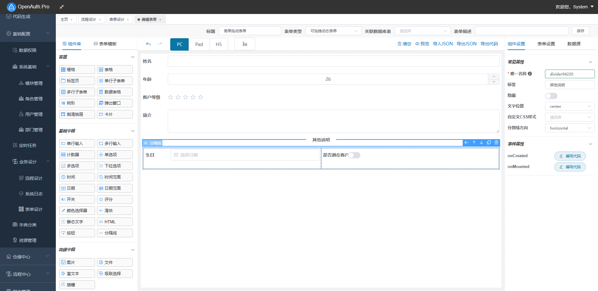

## ❤❤❤郑重声明❤❤❤

主分支main运行环境为 **.Net SDK 5.0/6.0/7.0**

需要.Net 4.0/4.5开发环境的同学请查看本项目4.0分支

使用.Net Core 2.1--3.1的请看：

**GitHub** https://github.com/yubaolee/OpenAuth.Core

**码云**  https://gitee.com/yubaolee/OpenAuth.Core

**logo图标含义** OpenAuth中OA字母的结合体；整体像鱼，授人以渔；你非说像咸鱼，那也是积极向上的咸鱼；中心是个笑脸，微笑面对生活(✿◡‿◡)。

**官方网站** http://www.openauth.net.cn

**官方文档**  http://doc.openauth.net.cn 

## 关于OpenAuth.Net企业版/高级版的说明：

目前OpenAuth.Net以全部开源的方式向大众开放,对于有经验的开发者，官方文档足以满足日常开发。为了能让项目走的更远，特推出基于vue + element UI 的单页面应用程序，即企业版/高级版OpenAuth.Pro

**该版本是一套后端基于OpenAuth.WebAPI接口，前端基于vue-element-admin，采用VUE全家桶（VUE+VUEX+VUE-ROUTER）单页面SPA开发的管理后台 [点击这里查看效果](http://demo.openauth.net.cn:1803)**

**另外** 企业版包含一套基于有赞Vant+Vue3的移动端界面，[请使用浏览器移动模式查看效果](http://demo.openauth.net.cn:1804)

企业版/高级版附赠VIP服务，提供VIP专属QQ群，企业报销凭据、专属内部文档、技术咨询服务等。[如何获取请查看这里](http://openauth.net.cn/question/detail.html?id=a2be2d61-7fcb-4df8-8be2-9f296c22a89c)，快加入VIP大家庭 **与有理想的.NET开发者一起成长**

效果如下：

## 官方QQ交流群  

1. ***618473076*** **社区VIP专属QQ群，第一时间提供开发进度、使用手册、技术咨询服务等，[如何加入VIP请移步这里](http://openauth.net.cn/question/detail.html?id=a2be2d61-7fcb-4df8-8be2-9f296c22a89c)**

1. 484498493【已满】

1. 626433139【已满】

1. 566344079【2K大群】

## 演示直达

* 企业版Vue2演示地址： http://demo.openauth.net.cn:1803

* 企业版H5演示地址（请使用浏览器移动模式或直接用手机打开）： http://demo.openauth.net.cn:1804 

* 开源版演示地址： http://demo.openauth.net.cn:1802

## 核心看点

* 支持.Net 4.0/4.5(已停止维护)及最新的.Net 5.0/6.0/7.0/...
  
* 同时支持EntityFramework、SqlSugar两款最流行的ORM框架

* 超强的自定义权限控制功能，可灵活配置用户、角色可访问的数据权限。请参考：[通用权限设计与实现](https://www.cnblogs.com/yubaolee/p/DataPrivilege.html)

* 完整的字段权限控制，可以控制字段可见及API是否返回字段值

* 可拖拽的表单设计  

* 可视化流程设计  

* 基于Quartz.Net的定时任务控制,可随时启/停，可视化配置Cron表达式功能

* 基于CodeSmith的代码生成功能，可快速生成带有头/明细结构的页面

* 支持sqlserver、mysql数据库，理论上支持所有数据库

* 集成IdentityServer4，实现基于OAuth2的登录体系

* 建立三方对接规范，已有系统可以无缝对接流程引擎

* 前端采用 vue + layui + elementUI + ztree + gooflow + leipiformdesign

* 后端采用 .net core +EF core+ autofac + quartz +IdentityServer4 + nunit + swagger

* 设计工具 PowerDesigner + Enterprise Architect

## 秀外

## 慧中

教科书级的分层思想，哪怕苛刻的你阅读的是大神级精典大作（如：《企业应用架构模式》《重构与模式》《ASP.NET设计模式》等），你也可以参考本项目。不信？有图为证，Resharper自动生成的项目引用关系，毫无PS痕迹！

## 权限资源

符合国情的RBAC（基于角色的访问控制），可以直接应用到你的系统。具体说明请查看：[通用权限设计与实现](https://www.cnblogs.com/yubaolee/p/DataPrivilege.html)

1. 菜单权限  经理和业务员登陆系统拥有的功能菜单是不一样的
2. 按钮权限  经理能够审批，而业务员不可以
3. 数据权限  A业务员看不到B业务员的单据
4. 字段权限  某些人查询客户信息时看不到客户的手机号或其它字段

**用户**应用系统的具体操作者，我这里设计用户是可以直接给用户分配菜单/按钮，也可以通过角色分配权限。

**角色**为了对许多拥有相似权限的用户进行分类管理，定义了角色的概念，以上所有的权限资源都可以分配给角色，角色和用户N:N的关系。

**机构**树形的公司部门结构，国内公司用的比较多，它实际上就是一个用户组，机构和用户设计成N:N的关系，也就是说有时候一个用户可以从属于两个部门，这种情况在我们客户需求中的确都出现过。

## 使用
管理员可直接在登录界面用System登录；

普通应用账号使用用户列表的用户登录，初始密码与用户名相同；

## 后续
生命不息，更新不止