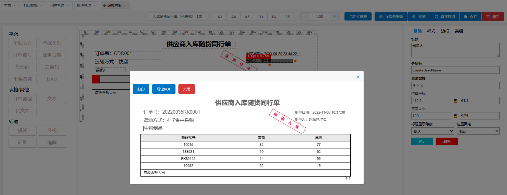
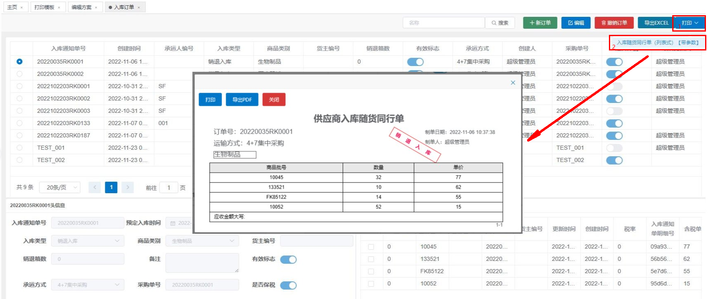

🔥.Net权限管理及快速开发框架、最好用的权限工作流系统。源于Martin Fowler企业级应用开发思想及最新技术组合（SqlSugar、EF、Quartz、AutoFac、WebAPI、Swagger、Mock、NUnit、Vue2/3、Element-ui/plus、IdentityServer等）。核心模块包括：角色授权、代码生成、智能打印、表单设计、工作流、定时任务等。架构易扩展，是中小企业的首选。

**logo图标含义** OpenAuth中OA字母的结合体；整体像鱼，授人以渔；你非说像咸鱼，那也是积极向上的咸鱼；中心是个笑脸，微笑面对生活(✿◡‿◡)。

**官方网站** http://www.openauth.net.cn

**官方文档**  http://doc.openauth.net.cn 

## ❤❤❤郑重声明❤❤❤

主分支main运行环境默认为.Net SDK 6.0，支持.NET未来版本，需要.Net SDK 4.0/4.5开发环境的同学请查看本项目4.0分支，已停止维护

使用.Net Core 2.1-3.1的请进：https://gitee.com/yubaolee/OpenAuth.Core ，已停止维护

## OpenAuth.Net系列视频火热更新中

[OpenAuth.Net视频合集--系统结构及代码下载](https://www.bilibili.com/video/BV1Z1421q7xU/)

[OpenAuth.Net视频合集--基于RBAC体系的权限管理介绍](https://www.bilibili.com/video/BV1M9KeejENf/)

[OpenAuth.Net视频合集--企业版代码启动](https://www.bilibili.com/video/BV1KSuQebEek/)

[OpenAuth.Net视频合集--使用企业版代码生成器](https://www.bilibili.com/video/BV1JCuyeaEFp/)

[OpenAuth.Net视频合集--表单设计](https://www.bilibili.com/video/BV1dagEeFEVA/)

## 关于OpenAuth.Net vue2/vue3版本的说明：

目前OpenAuth.Net以全部开源的方式向大众开放,对于有经验的开发者，官方文档足以满足日常开发。为了能让项目走的更远，特推出基于vue2 + element-ui /vue3 + element-plus的单页面应用程序，即高级版/企业版

**该版本是一套后端基于OpenAuth.WebAPI接口，前端基于elementUI/elementPlus，采用VUE全家桶（VUE+VUEX+VUE-ROUTER）单页面SPA开发的管理后台:

* Vue2演示地址： http://demo.openauth.net.cn:1803

* Vue3演示地址： http://demo.openauth.net.cn:1805

**另外** 企业版包含一套基于有赞Vant+Vue3的移动端界面，[请使用浏览器移动模式查看效果](http://demo.openauth.net.cn:1804)

企业版/高级版附赠VIP服务，提供VIP专属QQ群，企业报销凭据、专属内部文档、技术咨询服务等。[如何获取请查看这里](http://openauth.net.cn/question/detail.html?id=a2be2d61-7fcb-4df8-8be2-9f296c22a89c)，快加入VIP大家庭 **与有理想的.NET开发者一起成长**

效果如下：

## 官方QQ交流群  

1. ***618473076*** **社区VIP专属QQ群，第一时间提供开发进度、使用手册、技术咨询服务等，[如何加入VIP请移步这里](http://openauth.net.cn/question/detail.html?id=a2be2d61-7fcb-4df8-8be2-9f296c22a89c)**

1. 484498493【已满】

1. 626433139【已满】

1. 566344079【2K大群】

## 演示直达

* Vue2演示地址： http://demo.openauth.net.cn:1803

* Vue3演示地址： http://demo.openauth.net.cn:1805

* 移动H5演示地址（请使用浏览器移动模式或直接用手机打开）： http://demo.openauth.net.cn:1804 

* 开源版演示地址： http://demo.openauth.net.cn:1802

## 核心看点
  
* 同时支持EntityFramework、SqlSugar两款最流行的ORM框架

* 符合国情的RBAC权限体系。超强的自定义权限控制功能，可灵活配置用户、角色可访问的数据权限。请参考：[通用权限设计与实现](https://www.cnblogs.com/yubaolee/p/DataPrivilege.html)

* 完整的字段权限控制，可以控制字段可见及API是否返回字段值

* 可拖拽的表单设计。详情：[可拖拽表单](http://doc.openauth.net.cn/pro/dragform.html)

* 可视化流程设计  
  
* 全网最好用的打印解决方案。详情:[智能打印](http://doc.openauth.net.cn/pro/printerplan.html)

* 基于Quartz.Net的定时任务控制,可随时启/停，可视化配置Cron表达式功能

* 基于CodeSmith的代码生成功能，可快速生成带有头/明细结构的页面

* 支持sqlserver、mysql、Oracle、PostgreSql数据库，理论上支持所有数据库

* 集成IdentityServer4，实现基于OAuth2的登录体系

* 建立三方对接规范，已有系统可以无缝对接流程引擎

* 前端采用 vue + layui + element-ui + ztree + gooflow + leipiformdesign

* 后端采用 .net +EF + sqlsugar + autofac + quartz +IdentityServer4 + nunit + swagger

* 设计工具 PowerDesigner + Enterprise Architect

## 秀外

## 慧中

教科书级的分层思想，哪怕苛刻的你阅读的是大神级精典大作（如：《企业应用架构模式》《重构与模式》《ASP.NET设计模式》等），你也可以参考本项目。不信？有图为证，Resharper自动生成的项目引用关系，毫无PS痕迹！

## 使用
管理员可直接在登录界面用System登录；

普通应用账号使用用户列表的用户登录，初始密码与用户名相同；

## 后续
生命不息，更新不止